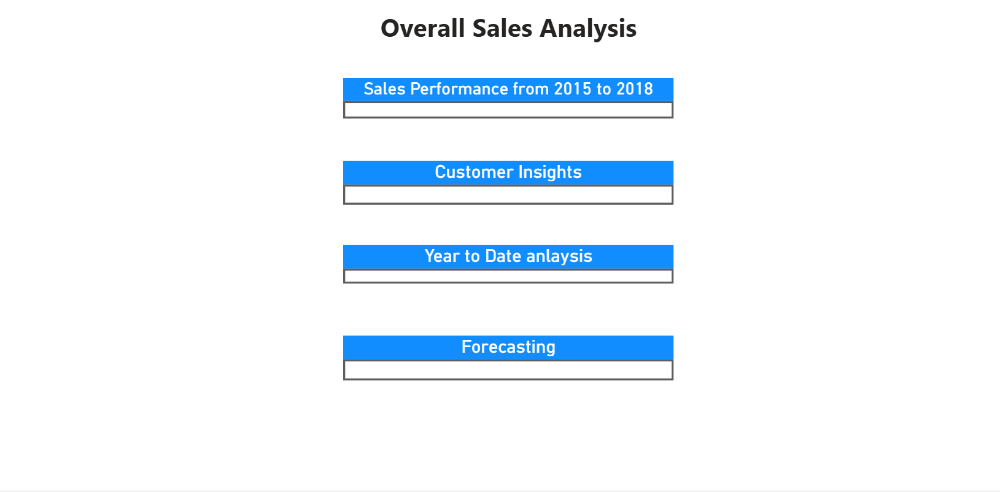
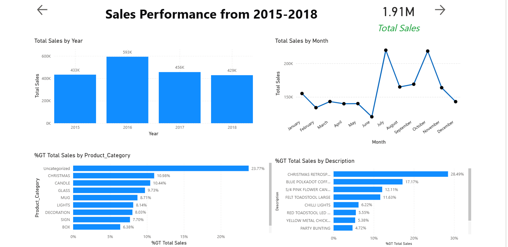
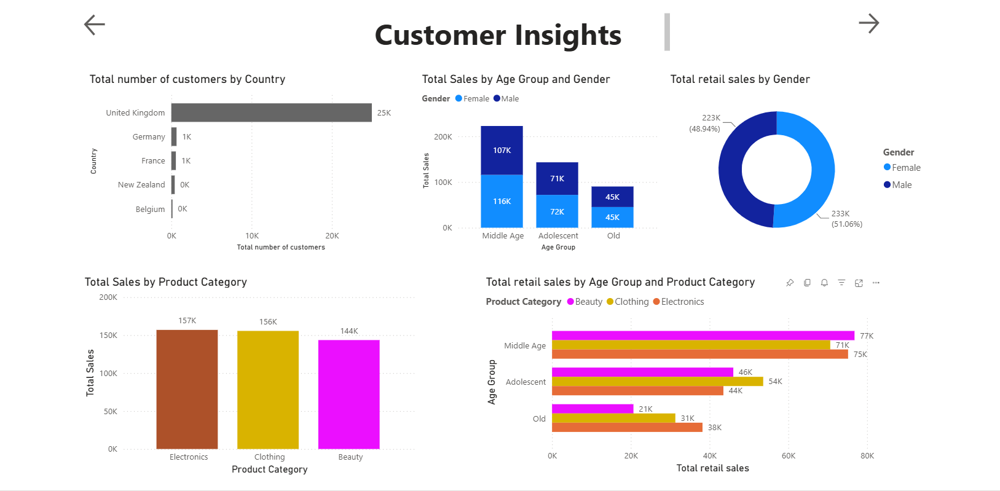
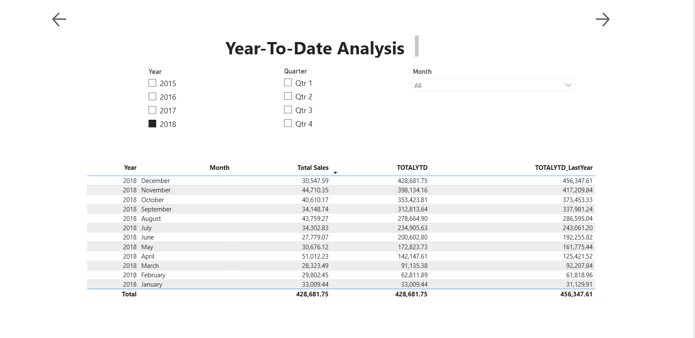
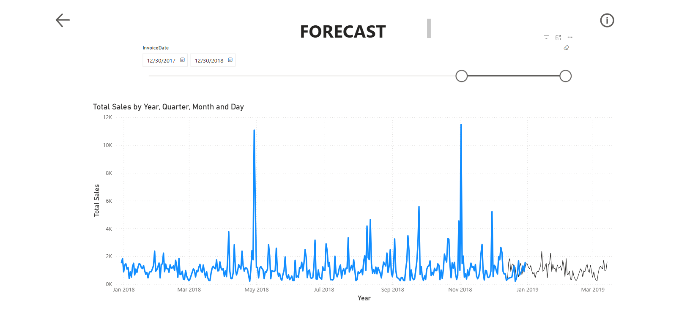

# Power-BI
Power BI screenshots

# Overview

Part of the course is to develop a Power BI dashboard, and the following screenshots showcase the key tasks that were completed throughout this process. The dashboard presents an Overall Sales Analysis, including sales performance from 2015 to 2018, where total sales reached approximately 1.91M, and trends are visualised across both yearly and monthly levels. It also highlights product-level contributions, identifying top-performing categories and items that drive revenue. The Customer Insights section provides a detailed view of customer distribution by country, age group, and purchasing behaviour, along with comparisons of sales by gender and product categories. In addition, the dashboard includes a Year-to-Date (YTD) Analysis, which tracks cumulative sales performance over time and compares current results with the previous year, enabling better performance monitoring. Lastly, a Forecasting component is incorporated to predict future sales trends based on historical data, demonstrating the ability to apply analytical and predictive techniques. Overall, these dashboards reflect strong skills in transforming raw data into interactive, insightful visualisations that support data-driven decision-making.

# Dashboard

