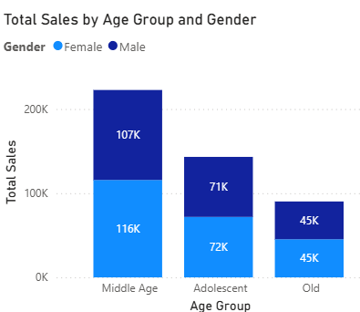

# Power-BI
Power BI TASK

# Overview

Part of the course is to develop a Power BI dashboard, A. Overview
The project focuses on analyzing the sales performance of an international online retail company using datasets stored in an Azure SQL database. The project combined a primary dataset consisting of Date, Product, Invoice, and Sales tables with a secondary customer insights dataset containing demographic information such as age, gender, and product category preferences. Using Power BI, the team performed data cleaning, modeling, visualization, and advanced analytics to uncover key business trends and generate actionable insights. The analysis aimed to evaluate historical sales performance, understand customer behavior, identify revenue drivers, and assess areas of risk affecting business growth. Through interactive dashboards and reports, the team transformed raw data into meaningful business intelligence to support strategic decision-making.

Insert Graph 1: Sales by Year (2015–2018)
Insert Graph 2: Monthly Sales Trend and Seasonality Analysis

# Objective 
The primary objective of this project was to analyze the company's sales and customer data to identify trends, opportunities, and challenges impacting business performance. The analysis sought to understand historical sales patterns, evaluate product and category performance, assess customer demographics and geographic distribution, and determine the causes of the current decline in sales. Additionally, a secondary retail customer insights dataset was incorporated to validate findings and provide deeper context regarding customer purchasing behavior. The ultimate goal was to leverage data-driven insights and Power BI visualizations to develop strategic recommendations that would help the company improve sales performance, reduce business risks, and achieve sustainable growth.

# Methodology
The team collected data from Azure SQL and an external retail dataset, then cleaned, transformed, and modeled the data in Power BI. Various analytical techniques, including sales trend analysis, customer segmentation, product performance evaluation, and forecasting, were used to generate insights and create interactive dashboards.

# Results
Financial and Sales Performance
The company generated approximately $1.19 million in sales between 2015 and 2018, with 2016 contributing $593,000, making it the strongest performing year. Sales showed clear seasonal peaks during the mid-year period (June–August) and holiday season (September–November).

# Product Performance
Product Performance
Uncategorized products and Christmas-related products generated the highest sales. The Christmas Retrospot Star Wood was identified as the top-performing product across all years, making it a significant contributor to revenue but also creating dependency on a seasonal item.

Insert Graph 6: Sales by Product Category
Insert Graph 7: Top 10 Products by Sales

# Customer Insights
Customer activity was heavily concentrated in the United Kingdom, which accounted for 93% of customers. Germany, France, New Zealand, and Belgium represented much smaller customer segments, indicating a high dependence on a single market.

Insert Graph 8: Customer Distribution by Country

-- Secondary Dataset Findings
The secondary dataset revealed that 51.06% of customers were female, while middle-aged consumers were the most frequent purchasers. It also showed that beauty products were more popular among middle-aged shoppers, while older customers spent more on electronics.

Insert Graph 10: Sales by Age Group
Insert Graph 11: Product Category Preferences by Age Group and Gender

# Year-To-Date (YTD) Analysis
The company experienced a 6.06% decline in YTD sales, resulting in a revenue shortfall of $27,665.86. The decline appears to be caused by overreliance on a seasonal top-selling product, concentration of revenue within a few categories, and heavy dependence on the UK market.

# Conclusion
Although the company achieved strong historical sales performance, the current sales decline highlights significant business risks. Without intervention, annual sales are expected to finish 6%–7.5% below the previous year. To improve performance, the company should diversify its products, strengthen customer retention in the UK, expand into new markets, and use demographic insights to better target high-value customer segments.

# Dashboard

